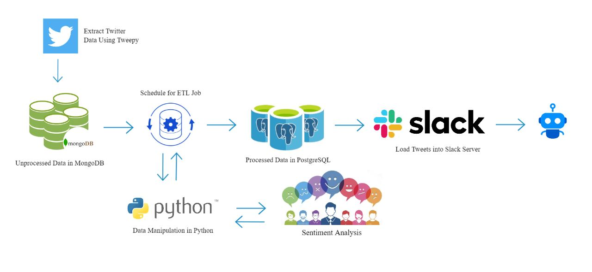
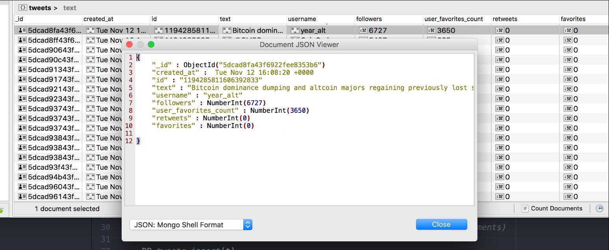
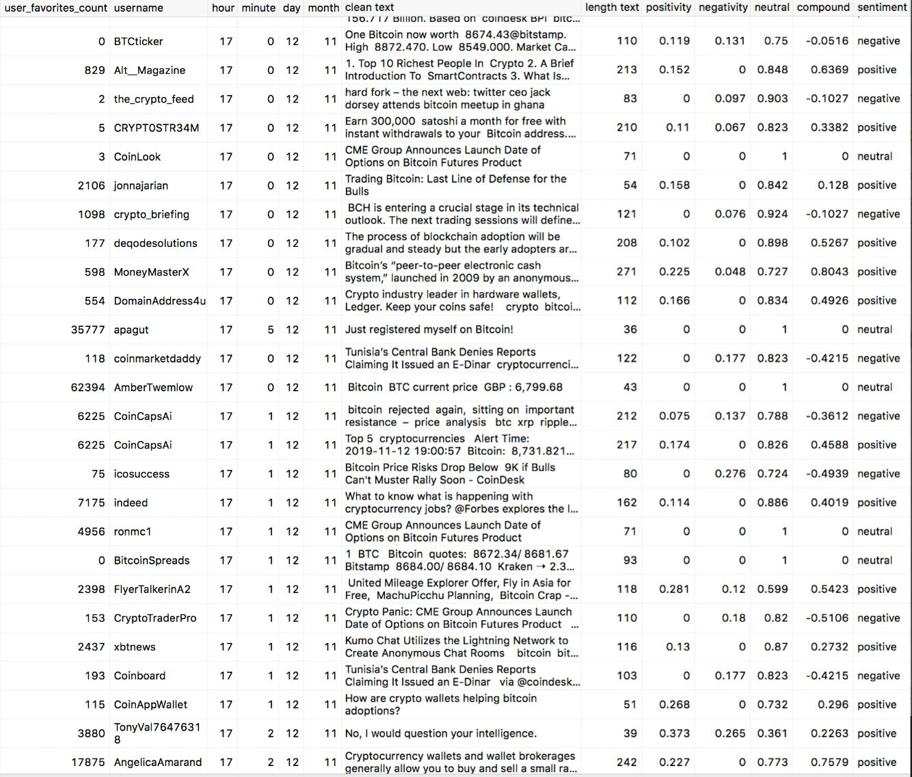
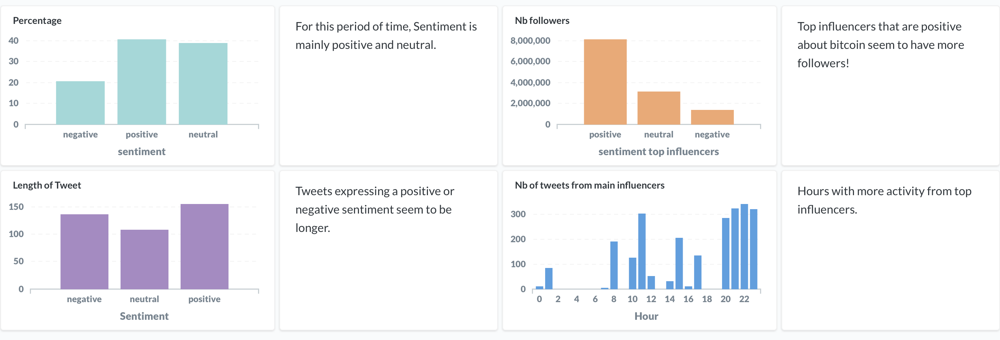
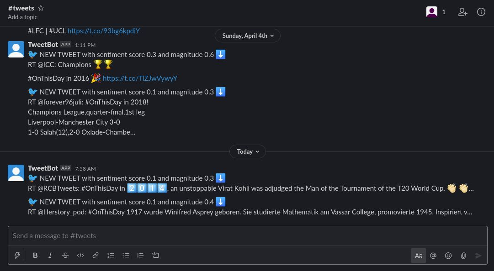

# Twitter Data Pipeline

## Introduction

In the following data pipeline we will analyze twitter data in order to extract the sentiment of the tweets and share them within the https://slack.com community.

## Extracting Twitter Data
The first component is located inside the folder `tweet_collector` Its primary function is to get tweets for `load_tweet_data.py`. You must get Twitter credentials via https://developer.twitter.com/en/apps in order to gain access to the authentication tokens, afterwhich you will be able to insert them into `config.py`. We will limit non-retweeted tweets from users with more than two thousand followers in order to extract only relevant information. 

## Loading Data Into MongoDB
MongoDB is a NoSQL database management system that stores data in JSON-like format with flexible schemas. Tweets will be continuously streamed into our database running within a docker container. We will use Studio 3T in order to access the twitter data from the 27017 port (`docker-compose.yml`). However, any other port should work just as fine if we decide to modify it down the line. 

## Configuring the ETL Process

We will utilize the index in order to get information from the Mongo database. This requires us to run `etl.py` in order to access the MongoDB index and the task number. 
In addition to the raw tweet data I also provided a positivity score, a negativity score, a neutrality and a label associated with each tweet.

## Configuring Slack API for Tweet Data
You will need to register at https://api.slack.com in order to get your User Authentication & Access Token for the Slack configuration. After this step is complete you can insert your authentication credentials into `tweet_to_slack.py`.

The data trigger will happen every hour, but can be easily adjusted towards your individual needs. The computed data will present the percentage of tweets being neutral, positive or negative, and post a message into the slack channel where you registered your app.

## A Sample Tweet From Our Slack Bot ;)

